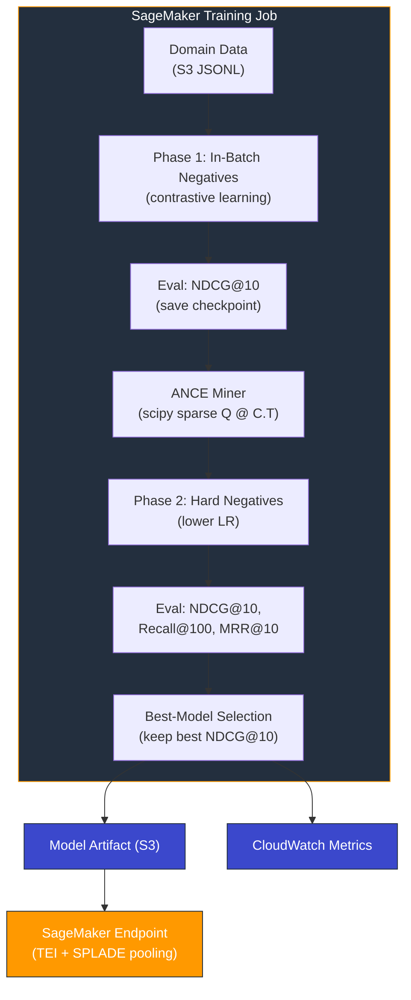

# Fine-Tuning SPLADE Sparse Embeddings on Amazon SageMaker

> Fine-tune a [SPLADE](https://arxiv.org/abs/2109.10086) sparse embedding model with ANCE hard negative mining, entirely self-contained inside a single SageMaker training job. No external vector databases, no network calls beyond SageMaker itself.



## Problem

Dense embedding models handle vocabulary mismatch well ("couch" finds "sofa") but collapse distinctions that matter. A query for "iPhone 256GB" retrieves 128GB models just as confidently. BM25 handles exact terms but lacks synonym expansion or concept matching.

[SPLADE](https://arxiv.org/abs/2107.05720) combines both: sparse vectors with exact term matching **plus** learned term expansion from a BERT MLM head. The output is interpretable, slots into inverted index infrastructure, and can be fine-tuned for your domain.

## Approach

Two-phase training pipeline on [`naver/splade-cocondenser-ensembledistil`](https://huggingface.co/naver/splade-cocondenser-ensembledistil), the strongest open SPLADE checkpoint. Built on [sentence-transformers v5](https://sbert.net/) `SparseEncoder`.

| Phase | What happens | Why |
|-------|-------------|-----|
| Phase 1 | Contrastive learning with in-batch negatives | Efficient baseline — every non-paired doc in batch is a negative |
| Phase 2 (ANCE) | Encode corpus, mine hard negatives via sparse matmul, retrain | Teaches the model from its own mistakes |
| Best-model selection | Compare Phase 1 vs ANCE on NDCG@10, keep the winner | ANCE can regress on small datasets (false negatives from unlabeled corpus) |

Same code, same hyperparameters across all three datasets — only the data changes.

## Dataset & Results

Three domains, evaluated in-domain (fine-tuned on each dataset's training split, evaluated on its test split). BM25 and [BGE-large-en-v1.5](https://huggingface.co/BAAI/bge-large-en-v1.5) (1024-dim dense) as baselines.

### Amazon ESCI: E-commerce Product Search

200K training pairs, 22,458 test queries, 503,839-document corpus. 4-level graded relevance (Exact/Substitute/Complement/Irrelevant).

| Metric | BM25 | BGE | Zero-shot | Fine-tuned | vs ZS | vs BM25 |
|--------|------|-----|-----------|------------|-------|---------|
| NDCG@10 | 0.377 | 0.441 | 0.463 | **0.489** | +5.6% | +30% |
| Recall@100 | 0.535 | 0.625 | 0.640 | **0.685** | +7.1% | +28% |
| MRR@10 | 0.586 | 0.654 | 0.671 | **0.686** | +2.2% | +17% |

### FiQA: Financial Question Answering

14,166 training pairs, 648 test queries, 57,638-document corpus. Binary relevance.

| Metric | BM25 | BGE | Zero-shot | Fine-tuned | vs ZS | vs BM25 |
|--------|------|-----|-----------|------------|-------|---------|
| NDCG@10 | 0.159 | **0.450** | 0.356 | 0.365 | +2.5% | +129% |
| Recall@100 | 0.359 | **0.770** | 0.636 | 0.694 | +9.0% | +93% |
| MRR@10 | 0.199 | **0.534** | 0.426 | 0.442 | +3.7% | +123% |

### NFCorpus: Biomedical Literature Retrieval

110,575 training pairs, 323 test queries, 3,633-document corpus. Graded relevance (0/1/2).

| Metric | BM25 | BGE | Zero-shot | Fine-tuned | vs ZS | vs BM25 |
|--------|------|-----|-----------|------------|-------|---------|
| NDCG@10 | 0.267 | **0.382** | 0.348 | 0.368 | +5.7% | +38% |
| Recall@100 | 0.211 | 0.364 | 0.284 | **0.416** | +46.3% | +98% |
| MRR@10 | 0.467 | **0.576** | 0.575 | 0.556 | -3.4% | +19% |

**Takeaway:** Fine-tuning improves over zero-shot on every dataset. SPLADE wins decisively at scale (ESCI) and on recall (NFCorpus). BGE-large wins on smaller datasets where pure semantic matching dominates (FiQA, NFCorpus NDCG). Best-model selection was critical — ANCE regressed on both small datasets, and the pipeline automatically fell back to the Phase 1 checkpoint.

## Setup

```bash
python3 -m venv .venv
source .venv/bin/activate
pip install sentence-transformers datasets bm25s scipy numpy tqdm pyyaml boto3 accelerate
```

## Usage

### 1. Prepare data

```bash
# Small datasets -- run locally
python datasets/prepare_fiqa.py --output-dir data/fiqa
python datasets/prepare_nfcorpus.py --output-dir data/nfcorpus

# Large datasets -- run on SageMaker Processing
python datasets/sagemaker_processing.py --dataset esci
python datasets/sagemaker_processing.py --dataset esci --max-pairs 200000  # subsample
```

Each script produces `train.jsonl`, `test.jsonl`, `corpus.jsonl`, and `bm25_baseline_results.json`.

### 2. Train locally (fast iteration)

```bash
# Truncated dataset (500 train, 100 test, 5000 corpus) for quick validation
python src/sagemaker_launcher.py --local --data-dir data/fiqa

# Full dataset, no truncation
python src/sagemaker_launcher.py --local --data-dir data/fiqa --no-truncate \
  --local-output local_model_output_fiqa_full
```

### 3. Train on SageMaker

```bash
python src/sagemaker_launcher.py --data-prefix splade-data/esci --skip-upload
```

Uses `ml.g5.2xlarge` with spot instances by default (max_wait=7200s).

### 4. Deploy and clean up

```bash
# Deploy to SageMaker real-time endpoint (TEI container with SPLADE pooling)
python deploy_endpoint.py --model-artifact s3://<bucket>/splade-training-output/model.tar.gz

# Delete endpoint when done
python deploy_endpoint.py --endpoint-name splade-esci-endpoint --delete
```

## File Structure

```
├── README.md
├── deploy_endpoint.py                    # Deploy / evaluate / delete endpoint
├── src/                                  # Training pipeline (dataset-agnostic)
│   ├── train.py                          # Entry point (SageMaker + local)
│   ├── ance_miner.py                     # ANCE hard negative mining (scipy sparse)
│   ├── evaluate.py                       # NDCG@10, Recall@100, MRR@10
│   ├── sagemaker_launcher.py             # Launch SageMaker job or run locally
│   ├── config.yaml                       # Hyperparameters
│   └── requirements.txt                  # Training container deps
├── datasets/                             # Per-dataset data preparation
│   ├── common.py                         # Shared: BM25 eval, metrics, I/O
│   ├── prepare_esci.py                   # Amazon ESCI (e-commerce)
│   ├── prepare_fiqa.py                   # FiQA (financial QA)
│   ├── prepare_nfcorpus.py              # NFCorpus (biomedical)
│   └── sagemaker_processing.py           # SageMaker Processing for large datasets
└── data/                                 # Generated output (gitignored)
    ├── esci/
    ├── fiqa/
    └── nfcorpus/
```

## Key Technical Decisions

- **All-in-one training job**: Both training phases, ANCE mining, and evaluation run inside a single SageMaker container. No orchestration, no external services.
- **Scipy sparse over vector DB**: SPLADE vectors have ~50-200 non-zero entries out of ~30K dimensions. CSR matrix + batch dot product leverages BLAS-optimized sparse linear algebra with zero dependencies. 500K corpus mines in minutes.
- **Best-model selection**: ANCE hard negatives can surface false negatives from unlabeled corpus entries, degrading small-dataset performance. The pipeline saves Phase 1 and automatically restores it if ANCE regresses.
- **Graded relevance**: NFCorpus preserves `raw_score` (0/1/2) for NDCG; ESCI uses 4-level E/S/C/I labels mapped to graded scores.
- **SageMaker SDK v3**: Uses `ModelTrainer` API exclusively (not legacy framework estimators). Note: SDK v3.4.1 has a [known bug](https://github.com/aws/sagemaker-python-sdk/issues/5518) with `get_training_code_hash()` — patched in `sagemaker_launcher.py`.
