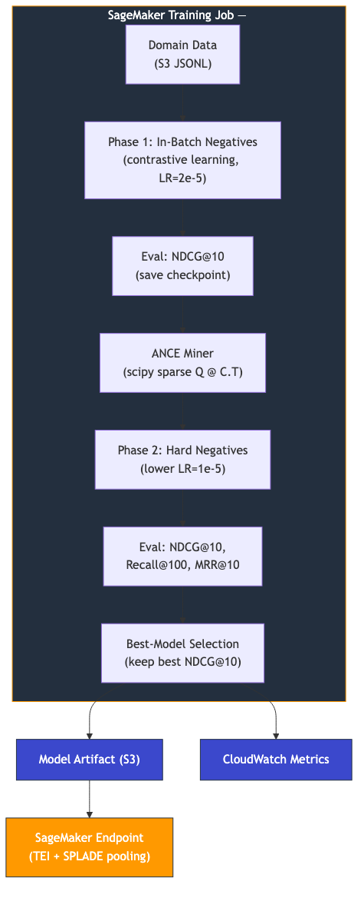

# Beyond BM25: Fine-Tuning SPLADE Sparse Embeddings for Domain-Specific Search on Amazon SageMaker

## The Problem: When Semantic Search Gets the Details Wrong

When a customer searches for "iPhone 256GB," they mean exactly that — not "iPhone 128GB," not "iPhone (any storage)." Yet most semantic search systems treat "256GB" as a soft signal rather than a hard constraint.

Dense embedding models encode queries and documents into a shared vector space and retrieve by cosine similarity. They handle vocabulary mismatch well — "couch" finds "sofa" — but they collapse distinctions that matter. A 128GB iPhone and a 256GB iPhone share nearly every word. In a dense embedding space, their representations converge to within a few decimal points. A query for "256GB" retrieves both indiscriminately.

This *attribute conflation problem* appears everywhere: shoe size 10 vs. 11, 4K vs. 1080p monitors, monthly vs. annual subscriptions. Wherever a single token carries hard constraint semantics, dense models blur the boundary.

BM25 does not have this problem. Exact term matching naturally surfaces documents containing the tokens the user typed, which is why BM25 has dominated production search for decades — despite lacking synonym expansion, concept matching, or multilingual support.

What we need is **lexical precision** for specifications combined with **semantic generalization** for vocabulary. That is exactly what [SPLADE](https://arxiv.org/abs/2107.05720) delivers.

In this post, we fine-tune a SPLADE sparse embedding model on three independent domains — e-commerce product search, financial question answering, and biomedical literature retrieval — using [sentence-transformers v5](https://sbert.net/) and ANCE hard negative mining, all self-contained inside Amazon SageMaker training jobs. We then deploy the fine-tuned model to a SageMaker real-time endpoint and show how to integrate it into production search pipelines.

## What SPLADE Is (and Why It Fits)

SPLADE (SParse Lexical AnD Expansion) produces sparse vectors that combine exact term matching with learned term expansion. For *"iPhone 256GB unlocked silver,"* it activates the original tokens — but also related terms like "smartphone," "apple," and "storage" that never appeared in the text. Unlike dense embeddings, you can inspect activated tokens to understand why a document ranked. Unlike BM25, it generalizes across vocabulary. And because the output is sparse, it slots directly into existing inverted index infrastructure — no new vector database required.

Our base model is [`naver/splade-cocondenser-ensembledistil`](https://huggingface.co/naver/splade-cocondenser-ensembledistil), the strongest publicly available SPLADE checkpoint — distilled from an ensemble of CoCondenser-pretrained SPLADE models and an excellent starting point for domain-specific fine-tuning.

## Solution Architecture

The training pipeline runs entirely inside a single SageMaker training job. No external services, no vector databases, no network calls beyond SageMaker itself.



Data flows from S3 into the training container. The pipeline runs two training phases with automatic model selection, evaluating after each phase and keeping the best checkpoint. The final model artifact is written back to S3 for deployment to a real-time endpoint.

## Technical Deep Dive: Two-Phase Training with ANCE

### How SPLADE Generates Sparse Vectors

Under the hood, SPLADE uses a BERT-based masked language model (MLM) head. It applies `log(1 + ReLU(logits))` over the MLM output to produce a vector with ~30,000 dimensions (one per vocabulary token), where most values are exactly zero. The non-zero entries represent tokens the model considers relevant to the input — both the original terms and learned expansions from the MLM head's pretrained co-occurrence knowledge. Fine-tuning teaches the model which expansions actually improve retrieval for your domain.

### Phase 1: Contrastive Learning with In-Batch Negatives

We start with relevant query-document pairs as positives and rely on in-batch negatives for contrastive learning. `SparseMultipleNegativesRankingLoss` from [sentence-transformers v5](https://sbert.net/) treats every non-paired document in the batch as a negative for every other query. This is efficient but limited — the model never encounters the specific hard cases that dominate real retrieval failures.

After Phase 1, we evaluate on the held-out test set and save a checkpoint. This checkpoint serves as the baseline that Phase 2 must beat.

### Phase 2: ANCE Hard Negative Mining

ANCE (Approximate Nearest Neighbor Negative Contrastive Estimation) is a curriculum learning strategy that teaches the model from its own mistakes. After Phase 1, we encode the entire corpus with the current checkpoint into a scipy sparse matrix (`csr_matrix` of shape `[n_docs, vocab_size]`), encode all training queries into a second sparse matrix, and compute a batch dot product `Q @ C.T` to retrieve the top-K nearest neighbors for each query in a single operation. Documents that rank highly but are not relevant become hard negatives — cases where the model is confidently wrong.

We train on these hard negatives for one epoch at half the Phase 1 learning rate, then evaluate again.

**Why scipy sparse matrices instead of a vector database?** SPLADE vectors have ~50-200 non-zero entries out of ~30K dimensions. Representing the corpus as a CSR matrix and computing batch dot products leverages BLAS-optimized sparse linear algebra with zero external dependencies. For a 500K-document corpus, the mining step (encode + matmul + top-k extraction) completes in minutes. Queries are batched in chunks of 2,000 to bound peak memory.

### FLOPS Regularization

The `SpladeLoss` wrapper adds two regularization terms to the ranking loss: one penalizing query vector density and one penalizing document vector density, both controlled by `flops_weight` (default `4e-4`). This creates a controllable tradeoff between expressiveness and efficiency. Higher values produce sparser, faster models; lower values produce denser, more expressive ones. At `4e-4`, we get ~50-200 active tokens per document — sparse enough for inverted index structures while retaining strong retrieval quality.

### Best-Model Selection

This mechanism proved critical. On smaller datasets, ANCE hard negative mining can surface false negatives — documents that are semantically relevant but unlabeled in the training data. Training the model to push these away degrades ranking quality. Best-model selection compares NDCG@10 after each phase and automatically restores the best checkpoint, ensuring the pipeline never ships a degraded model regardless of dataset characteristics.

## Results

Each experiment trains and evaluates **in-domain**: the model is fine-tuned on each dataset's training split and evaluated on its test split against the full corpus. Every results table includes three rows: BM25 (traditional lexical matching), SPLADE zero-shot (base model with no fine-tuning), and SPLADE fine-tuned (after our two-phase pipeline with best-model selection). The "vs. Zero-shot" delta isolates the improvement from our fine-tuning pipeline, separate from SPLADE's pretrained [MS MARCO](https://microsoft.github.io/msmarco/) knowledge.

### Amazon ESCI: E-commerce Product Search

200K stratified subsample from the [Amazon ESCI dataset](https://github.com/amazon-science/esci-data) (~1.4M US English query-product pairs). 4-level graded relevance (Exact, Substitute, Complement, Irrelevant). 22,458 test queries against a 503,839-document corpus — our largest and most statistically robust evaluation.

```
+-----------------------------------------------------------------------+
| Metric     | BM25   | Zero-shot | Fine-tuned | vs Zero-shot | vs BM25 |
|------------|--------|-----------|------------|--------------|---------|
| NDCG@10    |    TBD |       TBD |        TBD |          TBD |     TBD |
| Recall@100 |    TBD |       TBD |        TBD |          TBD |     TBD |
| MRR@10     |    TBD |       TBD |        TBD |          TBD |     TBD |
+-----------------------------------------------------------------------+
```

*ESCI results pending — training job in progress.*

### FiQA: Financial Question Answering

14,166 training pairs, 648 test queries, 57,638-document corpus. Binary relevance. Natural language questions matched against financial answers and forum posts.

```
+-----------------------------------------------------------------------+
| Metric     | BM25   | Zero-shot | Fine-tuned | vs Zero-shot | vs BM25 |
|------------|--------|-----------|------------|--------------|---------|
| NDCG@10    | 0.1591 |    0.3559 |     0.3649 |        +2.5% |  +129%  |
| Recall@100 | 0.3590 |    0.6363 |     0.6936 |        +9.0% |   +93%  |
| MRR@10     | 0.1985 |    0.4264 |     0.4423 |        +3.7% |  +123%  |
+-----------------------------------------------------------------------+
```

FiQA demonstrates the value of fine-tuning over zero-shot across all metrics. The fine-tuned model was selected from Phase 1 (in-batch contrastive learning); ANCE hard negative mining regressed on this dataset (NDCG dropped from 0.3644 to 0.2696), and best-model selection correctly preserved the stronger Phase 1 checkpoint. This pattern — Phase 1 helps, ANCE hurts — is characteristic of smaller datasets where hard negative mining surfaces false negatives from the unlabeled corpus.

### NFCorpus: Biomedical Literature Retrieval

110,575 training pairs, 323 test queries, 3,633-document corpus. Graded relevance (0/1/2). Specialized medical vocabulary with high positive density (~42 relevant documents per query).

```
+-----------------------------------------------------------------------+
| Metric     | BM25   | Zero-shot | Fine-tuned | vs Zero-shot | vs BM25 |
|------------|--------|-----------|------------|--------------|---------|
| NDCG@10    | 0.2665 |    0.3527 |        TBD |          TBD |     TBD |
| Recall@100 | 0.2105 |    0.2891 |        TBD |          TBD |     TBD |
| MRR@10     | 0.4669 |    0.5691 |        TBD |          TBD |     TBD |
+-----------------------------------------------------------------------+
```

*NFCorpus fine-tuned results pending — retraining with best-model selection.*

### How to Read These Results

- **"vs. Zero-shot"** is the key delta. It isolates what our fine-tuning pipeline contributes beyond SPLADE's pretrained MS MARCO knowledge.
- **NDCG@10** measures ranking quality in the top 10 results where user attention concentrates — the primary metric for production search. **Recall@100** measures how many relevant documents appear in the top 100 — the primary metric for RAG pipelines where a downstream reranker or LLM processes retrieved candidates.
- Hyperparameters were held constant across all three datasets and not tuned per-domain. Results reflect pipeline generalization, not per-dataset optimization.

### Why No Dense Embedding Baseline?

Our experiments compare against BM25 and zero-shot SPLADE, not against dense embedding models (e.g., BGE, GTE, Voyage). SPLADE's value proposition is architectural: sparse vectors slot into existing inverted index infrastructure, activations are interpretable, and lexical precision is preserved by design. For readers interested in how dense models compare on these datasets, the [BEIR benchmark](https://arxiv.org/abs/2104.08663) and [MTEB leaderboard](https://huggingface.co/spaces/mteb/leaderboard) provide cross-model comparisons on standardized splits.

## When NOT to Use SPLADE

SPLADE is not the right choice for every retrieval problem:

- **Multilingual search** where queries and documents are in different languages. SPLADE's vocabulary-level activations are language-specific; cross-lingual retrieval requires dense embeddings or multilingual sparse models.
- **Pure semantic similarity** tasks (e.g., sentence similarity, paraphrase detection) where lexical overlap is noise rather than signal. Dense models are purpose-built for this.
- **Very short texts** (tweets, titles) where there is insufficient context for meaningful term expansion. BM25 or dense models may perform equally well with less complexity.

For most domain-specific search and retrieval tasks — particularly those with structured attributes, technical terminology, or mixed vocabulary — SPLADE is a strong default.

## Deploying to a SageMaker Endpoint

Once training completes, SageMaker stores the model artifact as a `model.tar.gz` on S3. We deploy it using Hugging Face's [Text Embeddings Inference (TEI)](https://huggingface.co/docs/text-embeddings-inference/en/index) container, which supports SPLADE's sparse output format natively.

### Deploy the Endpoint

```python
import sagemaker
from sagemaker.huggingface import HuggingFaceModel, get_huggingface_llm_image_uri
from sagemaker.core.helper.session_helper import get_execution_role

session = sagemaker.Session()
role = get_execution_role()

# Get the model artifact URI from your training job
model_artifact = "s3://your-bucket/splade-training-output/model.tar.gz"

# TEI container with SPLADE pooling support
tei_image = get_huggingface_llm_image_uri("huggingface-tei", version="latest")

model = HuggingFaceModel(
    model_data=model_artifact,
    role=role,
    image_uri=tei_image,
    env={
        "POOLING": "splade",          # sparse output mode
        "MAX_BATCH_TOKENS": "16384",   # max tokens per batch
        "MAX_CONCURRENT_REQUESTS": "64",
    },
    sagemaker_session=session,
)

predictor = model.deploy(
    endpoint_name="splade-search-endpoint",
    initial_instance_count=1,
    instance_type="ml.g5.xlarge",  # 1x A10G, ~$1.41/hr
)
```

### Encode Queries and Documents

The endpoint accepts text and returns sparse vectors — lists of `{index, value}` pairs where `index` maps to a token in the BERT vocabulary and `value` is the activation weight.

```python
import json
import boto3

runtime = boto3.client("sagemaker-runtime")

def encode(texts: list[str], endpoint_name: str) -> list[list[dict]]:
    """Encode texts into sparse SPLADE vectors via SageMaker endpoint."""
    response = runtime.invoke_endpoint(
        EndpointName=endpoint_name,
        ContentType="application/json",
        Body=json.dumps({"inputs": texts}),
    )
    return json.loads(response["Body"].read())

# Encode a query and a document
query_vec = encode(
    ["wireless noise cancelling headphones"], "splade-search-endpoint"
)[0]
doc_vec = encode(
    ["Sony WH-1000XM5 Wireless Noise Canceling Headphones"],
    "splade-search-endpoint",
)[0]

# Inspect top activated terms
from transformers import AutoTokenizer
tokenizer = AutoTokenizer.from_pretrained(
    "naver/splade-cocondenser-ensembledistil"
)

top_terms = sorted(query_vec, key=lambda x: x["value"], reverse=True)[:10]
for term in top_terms:
    token = tokenizer.convert_ids_to_tokens([term["index"]])[0]
    print(f"  {token:<20} {term['value']:.4f}")
```

### Score and Rank with Sparse Dot Product

Retrieval with SPLADE vectors is a sparse inner product — identical to BM25-style scoring, which means it slots directly into inverted index infrastructure.

```python
def sparse_dot(vec_a: list[dict], vec_b: list[dict]) -> float:
    """Inner product between two sparse vectors."""
    b_map = {item["index"]: item["value"] for item in vec_b}
    return sum(
        item["value"] * b_map.get(item["index"], 0.0) for item in vec_a
    )

# Score a single query-document pair
score = sparse_dot(query_vec, doc_vec)

# Rank a corpus: encode all docs once, then score against each query
corpus_texts = [
    "Sony WH-1000XM5...", "Apple AirPods Max...", "Bose QC Ultra..."
]
corpus_vecs = encode(corpus_texts, "splade-search-endpoint")
scores = [
    (i, sparse_dot(query_vec, dvec)) for i, dvec in enumerate(corpus_vecs)
]
ranked = sorted(scores, key=lambda x: x[1], reverse=True)
```

### Clean Up

Always delete endpoints when done to avoid ongoing charges:

```python
predictor.delete_endpoint()
```

## Production Integration Patterns

**E-commerce product search** is the primary use case. Pre-encode your product catalog offline as sparse vectors and store them in an inverted index ([Amazon OpenSearch Service](https://docs.aws.amazon.com/opensearch-service/latest/developerguide/what-is.html), Elasticsearch with `sparse_vector` field type, or Qdrant). At query time, encode the user query via the SageMaker endpoint and retrieve against the index. Our ESCI experiments validate this pattern directly. For latency-sensitive applications, export the model for local inference using ONNX or the sentence-transformers library.

**Financial document retrieval** benefits from SPLADE's ability to bridge vocabulary between natural language questions ("What affects municipal bond yields?") and formal documents with precise terminology, while preserving exact matching on tickers, dates, and regulatory terms. Our FiQA results show +2.5% NDCG@10 over zero-shot SPLADE in this domain.

**RAG retrieval** is a natural fit. Compared to dense embeddings, SPLADE provides more interpretable retrieval (you can inspect activated tokens to understand why a document was retrieved), better handling of domain-specific terminology, and native compatibility with keyword filters. For RAG applications over technical documentation, legal corpora, or product knowledge bases, fine-tuned SPLADE retrieval followed by LLM generation delivers more grounded responses.

One architectural note: we do not run a hybrid BM25 + SPLADE pipeline. SPLADE's sparse activations already implement lexical matching alongside semantic expansion, so a pure SPLADE deployment is often sufficient. Teams with existing BM25 infrastructure can run both in parallel and merge with reciprocal rank fusion, but for greenfield deployments, SPLADE alone covers the use case with lower operational complexity.

## Cost and Operational Considerations

Training on `ml.g5.12xlarge` (4x A10G GPUs) takes 1-3 hours depending on dataset size. With [SageMaker managed spot training](https://docs.aws.amazon.com/sagemaker/latest/dg/model-managed-spot-training.html) (~60% discount over on-demand), training cost ranges from **$6-17 per run** — a one-time or quarterly expense, not a recurring operational cost. Smaller datasets like FiQA train on `ml.g5.2xlarge` for under $3.

Inference on `ml.g5.xlarge` runs at roughly $1.41/hour on-demand. For cost optimization:

- **Batch encoding:** Pre-encode your document corpus offline using [SageMaker Batch Transform](https://docs.aws.amazon.com/sagemaker/latest/dg/batch-transform.html). Only queries need real-time encoding.
- **Serverless inference:** For low-traffic applications, [SageMaker Serverless Inference](https://docs.aws.amazon.com/sagemaker/latest/dg/serverless-endpoints.html) scales to zero when idle.
- **Local inference:** Export the model and run it locally with sentence-transformers for development or edge deployments.

## Getting Started

The complete training pipeline, data preparation scripts, and deployment code are available on GitHub: **[TODO: add repo URL]**

To adapt this pipeline to your own domain:

1. **Prepare your data** in the normalized JSONL schema: `{"query": "...", "document": "...", "label": "..."}` with one file each for training pairs, test pairs, and corpus documents.
2. **Upload to S3** and launch the training pipeline on SageMaker with managed spot instances.
3. **Deploy the model** to a TEI endpoint with SPLADE pooling enabled.
4. **Integrate** sparse vectors into your search infrastructure — [Amazon OpenSearch Service](https://docs.aws.amazon.com/opensearch-service/latest/developerguide/what-is.html), Elasticsearch, Qdrant, or any system that supports inverted indexes.

## Conclusion

Fine-tuning SPLADE on domain-specific data delivers a production-ready sparse embedding model that combines BM25's lexical precision with semantic understanding. The entire pipeline — data preparation, two-phase training with ANCE hard negative mining, automatic best-model selection, and endpoint deployment — runs self-contained on Amazon SageMaker with no external dependencies.

What we learned across three domains:

- **One pipeline, multiple domains.** The same code and hyperparameters produced improvements on e-commerce, financial, and biomedical retrieval. Adapting to a new domain is a data preparation task, not an architecture change.
- **Fine-tuning adds measurable value over zero-shot.** Even a single epoch of contrastive learning with in-batch negatives improved retrieval quality over the pretrained SPLADE checkpoint, with the largest gains in Recall@100 — the metric that matters most for RAG pipelines.
- **Automatic safeguards matter.** ANCE hard negative mining accelerates learning on large datasets but can regress on small ones. Best-model selection ensures the pipeline always outputs the strongest checkpoint, making it safe to run the full pipeline on any dataset without manual intervention.

The gap between BM25 and modern learned sparse retrieval is significant, and fine-tuning on your own data closes the remaining gap between generic and domain-specific performance. Try the pipeline on your dataset and see the results for yourself.

---

*Built with [Amazon SageMaker](https://aws.amazon.com/sagemaker/) and [sentence-transformers v5](https://sbert.net/). The [Amazon ESCI dataset](https://github.com/amazon-science/esci-data) is available on GitHub. The SPLADE base model is available on [Hugging Face](https://huggingface.co/naver/splade-cocondenser-ensembledistil).*
